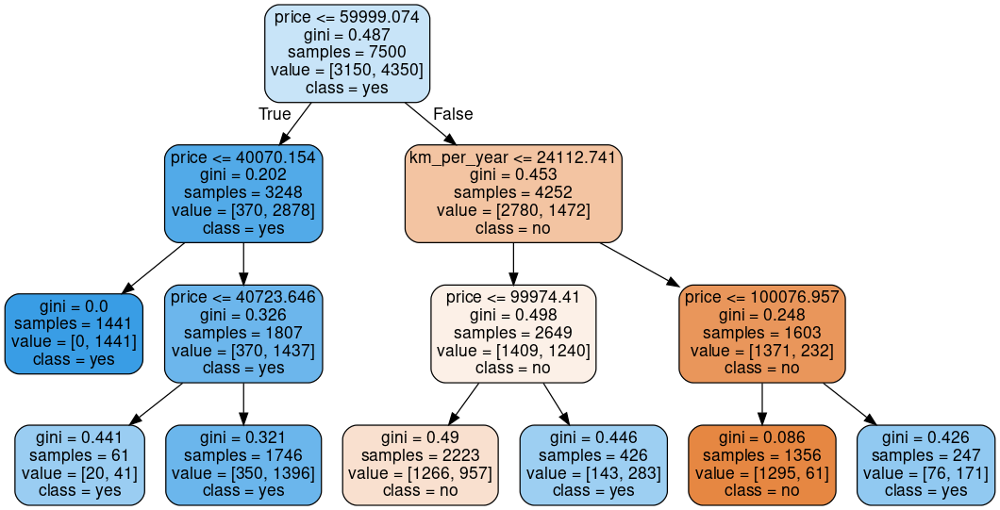

# Machine Learning - classification with sklearn
# What makes some cars sell and others not?
Identify why some cars were sold and others were not.


```python
import pandas as pd
import numpy as np
import matplotlib.pyplot as plt
import seaborn as sns

from datetime import datetime
from sklearn.preprocessing import StandardScaler
from sklearn.svm import SVC
from sklearn.svm import LinearSVC
from sklearn.metrics import accuracy_score
from sklearn.model_selection import train_test_split
from sklearn.dummy import DummyClassifier
from sklearn.tree import DecisionTreeClassifier
from sklearn.tree import export_graphviz
import graphviz

```


```python
uri = "https://gist.githubusercontent.com/guilhermesilveira/4d1d4a16ccbf6ea4e0a64a38a24ec884/raw/afd05cb0c796d18f3f5a6537053ded308ba94bf7/car-prices.csv"
data = pd.read_csv(uri)
data.head()
```


  <div id="df-25c761af-b9f4-4000-9e6e-2931c9b46a59" class="colab-df-container">
    <div>

<table border="1" class="dataframe">
  <thead>
    <tr style="text-align: right;">
      <th></th>
      <th>Unnamed: 0</th>
      <th>mileage_per_year</th>
      <th>model_year</th>
      <th>price</th>
      <th>sold</th>
    </tr>
  </thead>
  <tbody>
    <tr>
      <th>0</th>
      <td>0</td>
      <td>21801</td>
      <td>2000</td>
      <td>30941.02</td>
      <td>yes</td>
    </tr>
    <tr>
      <th>1</th>
      <td>1</td>
      <td>7843</td>
      <td>1998</td>
      <td>40557.96</td>
      <td>yes</td>
    </tr>
    <tr>
      <th>2</th>
      <td>2</td>
      <td>7109</td>
      <td>2006</td>
      <td>89627.50</td>
      <td>no</td>
    </tr>
    <tr>
      <th>3</th>
      <td>3</td>
      <td>26823</td>
      <td>2015</td>
      <td>95276.14</td>
      <td>no</td>
    </tr>
    <tr>
      <th>4</th>
      <td>4</td>
      <td>7935</td>
      <td>2014</td>
      <td>117384.68</td>
      <td>yes</td>
    </tr>
  </tbody>
</table>
</div>
    <div class="colab-df-buttons">

  <div class="colab-df-container">
    <button class="colab-df-convert" onclick="convertToInteractive('df-25c761af-b9f4-4000-9e6e-2931c9b46a59')"
            title="Convert this dataframe to an interactive table."
            style="display:none;">

  <svg xmlns="http://www.w3.org/2000/svg" height="24px" viewBox="0 -960 960 960">
    <path d="M120-120v-720h720v720H120Zm60-500h600v-160H180v160Zm220 220h160v-160H400v160Zm0 220h160v-160H400v160ZM180-400h160v-160H180v160Zm440 0h160v-160H620v160ZM180-180h160v-160H180v160Zm440 0h160v-160H620v160Z"/>
  </svg>
    </button>


  </div>


<div id="df-0d301f4d-dda4-41e3-8c04-9f07c7f0c172">
  <button class="colab-df-quickchart" onclick="quickchart('df-0d301f4d-dda4-41e3-8c04-9f07c7f0c172')"
            title="Suggest charts"
            style="display:none;">

  </button>


  </div>


```python
# Adjust sold column values
to_replace = {
    'no': 0,
    'yes': 1
}
data.sold = data.sold.map(to_replace)
data.head()
#
```


  <div id="df-518dbef9-cd4e-4d68-9571-63bfe300467e" class="colab-df-container">
    <div>

<table border="1" class="dataframe">
  <thead>
    <tr style="text-align: right;">
      <th></th>
      <th>Unnamed: 0</th>
      <th>mileage_per_year</th>
      <th>model_year</th>
      <th>price</th>
      <th>sold</th>
    </tr>
  </thead>
  <tbody>
    <tr>
      <th>0</th>
      <td>0</td>
      <td>21801</td>
      <td>2000</td>
      <td>30941.02</td>
      <td>1</td>
    </tr>
    <tr>
      <th>1</th>
      <td>1</td>
      <td>7843</td>
      <td>1998</td>
      <td>40557.96</td>
      <td>1</td>
    </tr>
    <tr>
      <th>2</th>
      <td>2</td>
      <td>7109</td>
      <td>2006</td>
      <td>89627.50</td>
      <td>0</td>
    </tr>
    <tr>
      <th>3</th>
      <td>3</td>
      <td>26823</td>
      <td>2015</td>
      <td>95276.14</td>
      <td>0</td>
    </tr>
    <tr>
      <th>4</th>
      <td>4</td>
      <td>7935</td>
      <td>2014</td>
      <td>117384.68</td>
      <td>1</td>
    </tr>
  </tbody>
</table>
</div>
    <div class="colab-df-buttons">

  <div class="colab-df-container">
    <button class="colab-df-convert" onclick="convertToInteractive('df-518dbef9-cd4e-4d68-9571-63bfe300467e')"
            title="Convert this dataframe to an interactive table."
            style="display:none;">


  </div>


<div id="df-00e66a89-968b-470b-bed3-4d7575dfe92b">
  <button class="colab-df-quickchart" onclick="quickchart('df-00e66a89-968b-470b-bed3-4d7575dfe92b')"
            title="Suggest charts"
            style="display:none;">


  </button>

</div>


  </div>


```python
# Calculate the age of a car model.
current_year = datetime.today().year
data['model_age'] = current_year - data.model_year
data.head()
```


  <div id="df-c3a09bff-829d-438d-bd5c-3fb72c8a7fff" class="colab-df-container">
    <div>

<table border="1" class="dataframe">
  <thead>
    <tr style="text-align: right;">
      <th></th>
      <th>Unnamed: 0</th>
      <th>mileage_per_year</th>
      <th>model_year</th>
      <th>price</th>
      <th>sold</th>
      <th>model_age</th>
    </tr>
  </thead>
  <tbody>
    <tr>
      <th>0</th>
      <td>0</td>
      <td>21801</td>
      <td>2000</td>
      <td>30941.02</td>
      <td>1</td>
      <td>24</td>
    </tr>
    <tr>
      <th>1</th>
      <td>1</td>
      <td>7843</td>
      <td>1998</td>
      <td>40557.96</td>
      <td>1</td>
      <td>26</td>
    </tr>
    <tr>
      <th>2</th>
      <td>2</td>
      <td>7109</td>
      <td>2006</td>
      <td>89627.50</td>
      <td>0</td>
      <td>18</td>
    </tr>
    <tr>
      <th>3</th>
      <td>3</td>
      <td>26823</td>
      <td>2015</td>
      <td>95276.14</td>
      <td>0</td>
      <td>9</td>
    </tr>
    <tr>
      <th>4</th>
      <td>4</td>
      <td>7935</td>
      <td>2014</td>
      <td>117384.68</td>
      <td>1</td>
      <td>10</td>
    </tr>
  </tbody>
</table>
</div>
    <div class="colab-df-buttons">

  <div class="colab-df-container">
    <button class="colab-df-convert" onclick="convertToInteractive('df-c3a09bff-829d-438d-bd5c-3fb72c8a7fff')"
            title="Convert this dataframe to an interactive table."
            style="display:none;">

  </div>


<div id="df-9160b319-1a13-4c65-8209-a88607954279">
  <button class="colab-df-quickchart" onclick="quickchart('df-9160b319-1a13-4c65-8209-a88607954279')"
            title="Suggest charts"
            style="display:none;">


  </button>


</div>


  </div>


```python
# Create the km_per_year column
data['km_per_year'] = data.mileage_per_year * 1.60934
data.head()
```


  <div id="df-75152bed-e47d-4bdc-9772-f660f2a36170" class="colab-df-container">
    <div>

<table border="1" class="dataframe">
  <thead>
    <tr style="text-align: right;">
      <th></th>
      <th>Unnamed: 0</th>
      <th>mileage_per_year</th>
      <th>model_year</th>
      <th>price</th>
      <th>sold</th>
      <th>model_age</th>
      <th>km_per_year</th>
    </tr>
  </thead>
  <tbody>
    <tr>
      <th>0</th>
      <td>0</td>
      <td>21801</td>
      <td>2000</td>
      <td>30941.02</td>
      <td>1</td>
      <td>24</td>
      <td>35085.22134</td>
    </tr>
    <tr>
      <th>1</th>
      <td>1</td>
      <td>7843</td>
      <td>1998</td>
      <td>40557.96</td>
      <td>1</td>
      <td>26</td>
      <td>12622.05362</td>
    </tr>
    <tr>
      <th>2</th>
      <td>2</td>
      <td>7109</td>
      <td>2006</td>
      <td>89627.50</td>
      <td>0</td>
      <td>18</td>
      <td>11440.79806</td>
    </tr>
    <tr>
      <th>3</th>
      <td>3</td>
      <td>26823</td>
      <td>2015</td>
      <td>95276.14</td>
      <td>0</td>
      <td>9</td>
      <td>43167.32682</td>
    </tr>
    <tr>
      <th>4</th>
      <td>4</td>
      <td>7935</td>
      <td>2014</td>
      <td>117384.68</td>
      <td>1</td>
      <td>10</td>
      <td>12770.11290</td>
    </tr>
  </tbody>
</table>
</div>
    <div class="colab-df-buttons">

  <div class="colab-df-container">
    <button class="colab-df-convert" onclick="convertToInteractive('df-75152bed-e47d-4bdc-9772-f660f2a36170')"
            title="Convert this dataframe to an interactive table."
            style="display:none;">


  </div>


<div id="df-6b8f5503-8e18-44de-9ece-b3f874245784">
  <button class="colab-df-quickchart" onclick="quickchart('df-6b8f5503-8e18-44de-9ece-b3f874245784')"
            title="Suggest charts"
            style="display:none;">


  </button>


</div>

  </div>


```python
data = data.drop(columns = ["Unnamed: 0", "mileage_per_year", "model_age"], axis=1)
data.head()
```


  <div id="df-7de11177-e43a-4dac-9295-c33ec9f873a2" class="colab-df-container">
    <div>

<table border="1" class="dataframe">
  <thead>
    <tr style="text-align: right;">
      <th></th>
      <th>model_year</th>
      <th>price</th>
      <th>sold</th>
      <th>km_per_year</th>
    </tr>
  </thead>
  <tbody>
    <tr>
      <th>0</th>
      <td>2000</td>
      <td>30941.02</td>
      <td>1</td>
      <td>35085.22134</td>
    </tr>
    <tr>
      <th>1</th>
      <td>1998</td>
      <td>40557.96</td>
      <td>1</td>
      <td>12622.05362</td>
    </tr>
    <tr>
      <th>2</th>
      <td>2006</td>
      <td>89627.50</td>
      <td>0</td>
      <td>11440.79806</td>
    </tr>
    <tr>
      <th>3</th>
      <td>2015</td>
      <td>95276.14</td>
      <td>0</td>
      <td>43167.32682</td>
    </tr>
    <tr>
      <th>4</th>
      <td>2014</td>
      <td>117384.68</td>
      <td>1</td>
      <td>12770.11290</td>
    </tr>
  </tbody>
</table>
</div>
    <div class="colab-df-buttons">

  <div class="colab-df-container">
    <button class="colab-df-convert" onclick="convertToInteractive('df-7de11177-e43a-4dac-9295-c33ec9f873a2')"
            title="Convert this dataframe to an interactive table."
            style="display:none;">

  </div>


<div id="df-ac8c224d-01f1-4d56-a394-ad44402c5739">
  <button class="colab-df-quickchart" onclick="quickchart('df-ac8c224d-01f1-4d56-a394-ad44402c5739')"
            title="Suggest charts"
            style="display:none;">


  </button>

</div>


  </div>


```python
# Classify
x = data[["price", "model_year", "km_per_year"]]
y = data["sold"]

# LinearSVC

SEED = 5

train_x, test_x, train_y, test_y = train_test_split(x, y,
                                                        random_state = SEED, test_size = 0.25,
                                                        stratify = y)

print("We will train with %d elements and test with %d elements" % (len(train_x), len(test_x)))

scaler = StandardScaler()
scaler.fit(train_x)
train = scaler.transform(train_x)
test_x = scaler.transform(test_x)

model = LinearSVC()
model.fit(train_x, train_y)
prevision = model.predict(test_x)

acuracia = accuracy_score(test_y, prevision) * 100
print("The accuracy was %.2f%%" % acuracia)
```

    We will train with 7500 elements and test with 2500 elements
    

    /usr/local/lib/python3.10/dist-packages/sklearn/svm/_classes.py:32: FutureWarning: The default value of `dual` will change from `True` to `'auto'` in 1.5. Set the value of `dual` explicitly to suppress the warning.
      warnings.warn(
    

    The accuracy was 47.04%
    

    /usr/local/lib/python3.10/dist-packages/sklearn/svm/_base.py:1250: ConvergenceWarning: Liblinear failed to converge, increase the number of iterations.
      warnings.warn(
    /usr/local/lib/python3.10/dist-packages/sklearn/base.py:465: UserWarning: X does not have valid feature names, but LinearSVC was fitted with feature names
      warnings.warn(
    


```python
dummy_stratified = DummyClassifier()
dummy_stratified.fit(train_x, train_y)
acuracia = dummy_stratified.score(test_x, test_y) * 100

print("The accuracy of the stratified dummy was %.2f%%" % acuracia)

```

    The accuracy of the stratified dummy was 58.00%
    


```python
dummy_mostfrequent = DummyClassifier()
dummy_mostfrequent.fit(train_x, train_y)
acuracia = dummy_mostfrequent.score(test_x, test_y) * 100

print("The accuracy of the mostfrequent dummy was %.2f%%" % acuracia)
```

    The accuracy of the mostfrequent dummy was 58.00%
    


```python
# Non-linear classifier using SVC

SEED = 5
np.random.seed(SEED)
raw_train_x, raw_test_x, train_y, test_y = train_test_split(x, y, test_size = 0.25,
                                                        stratify = y)

print("We will train with %d elements and test with %d elements" % (len(train_x), len(test_x)))

scaler = StandardScaler()
scaler.fit(raw_train_x)
train_x = scaler.transform(raw_train_x)
test_x = scaler.transform(raw_test_x)

model = SVC()
model.fit(train_x, train_y)
prevision = model.predict(test_x)

accuracia = accuracy_score(test_y, prevision) * 100
print("The accuracy was %.2f%%" % accuracia)
```

    We will train with 7500 elements and test with 2500 elements
    The accuracy was 77.48%
    


```python
# Using Decision Tree Classifier

SEED = 5
np.random.seed(SEED)
raw_train_x, raw_test_x, train, test_y = train_test_split(x, y, test_size = 0.25,
                                                        stratify = y)

print("We will train with %d elements and test with %d elements" % (len(train_x), len(test_x)))

model = DecisionTreeClassifier(max_depth=3)
model.fit(raw_train_x, train_y)
prevision = model.predict(raw_test_x)

acuracia = accuracy_score(test_y, prevision) * 100
print("The accuracy was %.2f%%" % acuracia)
```

    We will train with 7500 elements and test with 2500 elements
    The accuracy was 79.28%
    


```python

dot_data = export_graphviz(model,
                out_file = None, # out_file = "tree.dot",
                feature_names = x.columns,
                filled = True,
                rounded = True,
                class_names = ["no", "yes"]
                           )
graphic = graphviz.Source(dot_data)
graphic
```


    

    


```python

```
